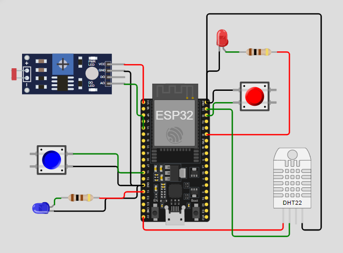

# Sistema de Irrigação Inteligente - FarmTech Solutions

## Descrição Geral

Este projeto simula um sistema de irrigação inteligente para agricultura de precisão, integrando sensores físicos (simulados) a um microcontrolador ESP32. O objetivo é coletar dados de sensores de umidade, nutrientes e pH, controlar uma bomba de irrigação (relé/LED) e armazenar os dados em um banco de dados SQL para análise posterior.

---

## Instruções de como rodar o Projeto Máquina Agrícola

- Clone o projeto para pasta local: 
  
  - *Opção 1*: Rodar o protótipo do Esp32 diretamente no VSCode: após abrir o projeto é necessário possuir extensão PlatformIO. Antes de fazer o build é necessário possuir uma licença do site wokwi [licença](https://wokwi.com/license). Em seguida realizar o buid do projeto. Após isso é necessário dar play para que seja gerado logs. Copie esses logs e os insira no arquivo [modelagem.txt](Database/modelagem.txt). Este arquivo é usado na entidade db_service para inserir os dados na tabela Lavoura.
  
  - *Opção 2*: Rodar o protótipo no site Wokwi: Ao abri o site [Wokwi](https://wokwi.com/) e clicar em ESP32 e abrir o primeiro starter template é necessário copiar o código no arquivo [logicaEsp32.ino](src/logicaEsp32.ino)
  e colocar na aba sketch.ino após isso é necessário copiar o código do arquivo [diagram](/diagram.json) e colocar na aba diagram e apertar play para que gere os logs no Monitor Serial. 
  . Copie esses logs e os insira no arquivo [modelagem.txt](Database/modelagem.txt). Este arquivo é usado na entidade db_service para inserir os dados na tabela Lavoura.

-  


## 1. Montagem do Circuito no Wokwi

O circuito foi montado na plataforma [Wokwi](https://wokwi.com/), utilizando os seguintes componentes:

- **ESP32 DevKit**
- **Botão vermelho:** Simula sensor de fósforo (P)
- **Botão azul:** Simula sensor de potássio (K)
- **LDR (Light Dependent Resistor):** Simula sensor de pH (variação analógica)
- **DHT22:** Sensor de umidade e temperatura do solo
- **LEDs:** Indicadores de presença de fósforo e potássio
- **Relé/LED:** Simula bomba de irrigação

### Imagem do Circuito



---

## 2. Lógica de Funcionamento

### Sensores Simulados

- **Sensor de Fósforo (P):**  
  Representado por um botão físico.  
  - Pressionado = presença de fósforo (LED vermelho aceso)
  - Solto = ausência de fósforo (LED vermelho apagado)

- **Sensor de Potássio (K):**  
  Representado por outro botão físico.  
  - Pressionado = presença de potássio (LED azul aceso)
  - Solto = ausência de potássio (LED azul apagado)

- **Sensor de pH:**  
  Simulado por um LDR.  
  - O valor lido do LDR representa o pH do solo (quanto mais luz, maior o valor).

- **Sensor de Umidade do Solo:**  
  Utiliza o DHT22 para ler a umidade e temperatura do solo.

- **Relé/LED:**  
  Simula a bomba de irrigação.  
  - Aciona automaticamente conforme a lógica definida (exemplo: umidade abaixo de um limite).

### Fluxo de Controle

1. O ESP32 lê todos os sensores a cada ciclo do loop.
2. Os valores dos sensores são enviados para o monitor serial.
3. O relé (LED) é acionado/desligado automaticamente conforme a lógica:
   - Exemplo: se a umidade estiver abaixo de 40%, a bomba é ligada.
4. Os dados do monitor serial são copiados e armazenados em um banco de dados SQLite via script Python.

---

## 3. Código do ESP32

Se encontra na pasta [src](src/) no arquivo [logicaEsp32](src/logicaEsp32.ino).

---

## 4. Armazenamento dos Dados em Banco de Dados SQL

Os dados lidos do monitor serial são copiados e armazenados em um banco de dados SQLite (`agro.db`) usando um script Python.  
O script realiza as operações CRUD (Create, Read, Update, Delete) na tabela `Dados_Lavoura`.

### Exemplo de Estrutura da Tabela

| id | ldr (pH) | umidade | temperatura |
|----|----------|---------|-------------|
| 1  |   594    |  45.00  |   29.00     |
| 2  |   620    |  43.00  |   21.00     |
|... |   ...    |  ...    |   ...       |

### Principais Operações CRUD

- **Inserção:**  
  Adiciona novos dados lidos dos sensores.

- **Consulta:**  
  Permite visualizar todos os dados armazenados.

- **Atualização:**  
  Permite alterar valores de um registro específico.

- **Remoção:**  
  Permite excluir registros do banco.

### Justificativa da Estrutura

A estrutura do banco foi baseada no MER da fase anterior, garantindo que cada leitura de sensores seja registrada com seus respectivos valores, permitindo análises históricas e estatísticas.

---

## 5. Como Executar

1. **Monte o circuito no Wokwi e rode o código no ESP32.**
2. **Copie os dados do monitor serial para o arquivo `modelagem.txt`.**
3. **Execute o script Python para inserir os dados no banco:**
   ```sh
   python db_services.py
   ```
4. **Utilize as funções CRUD do script para manipular os dados conforme necessário.**

---

## 6. Créditos

Projeto desenvolvido por João Domingues para a disciplina de Práticas de Código - Faculdade.

---
